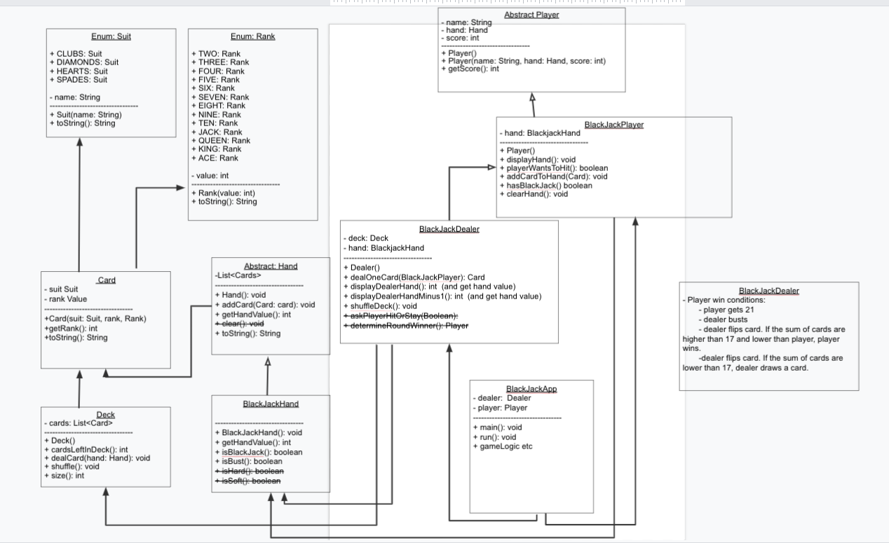

## Blackjack Project

### Overview
This project facilitates the game Blackjack. This program serves as the dealer and allows the user to play as many games as he or she wishes.

## Technologies Used
* UML
* Java
* Enums
* Object Oriented design
* Encapsulation
* Inheritance
* Abstraction

## Lessons Learned
* The importance of a good UML diagram prior to beginning coding.

